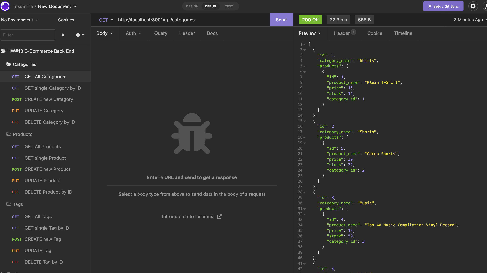
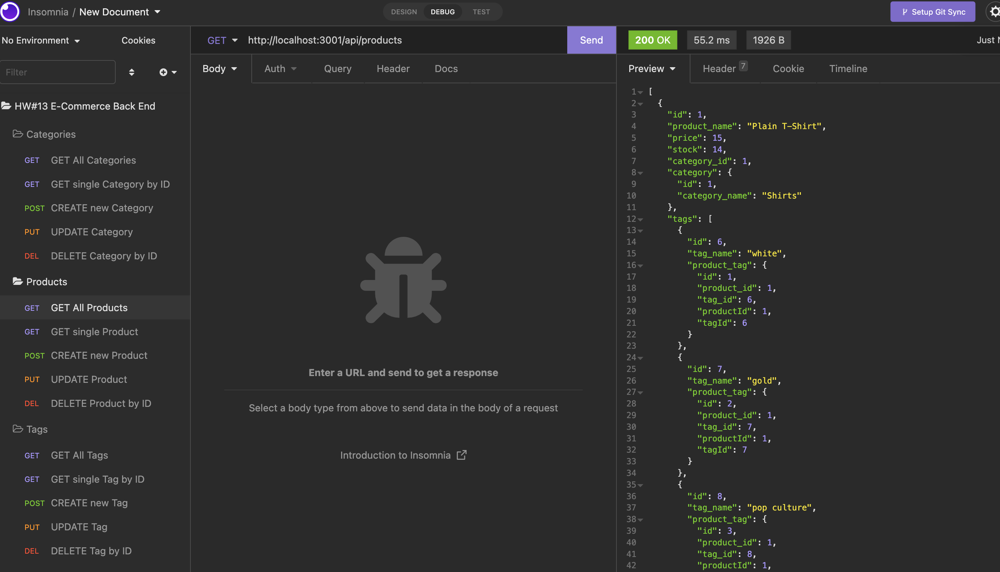
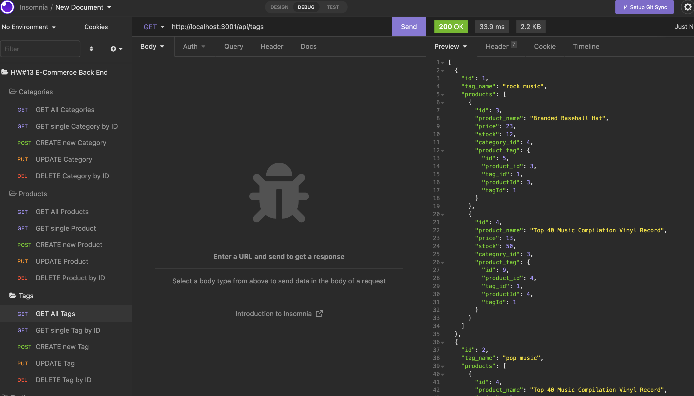

# E-Commerce Back End Project


## Link
Please click [here](https://watch.screencastify.com/v/TYZuKCjnm7X3lbCrqGXN) to find the walkthrough video that demonstrates the functionality of the E-Commerce Back End application

## Description

The E-Commerce Back End application is a pure back end application that configuring with Express.js API to use Sequelize to interact with MySQL database. Since this is a pure back end application, it is recommended to use API testing tool like Insomnia to test and run all the routes

This back end application can be used to support internet retail company for managing their business database. It includes three main routes: for categories, products, or tags. User can run GET routes to see all categories, all products, or all tags, or run GET routes to see a single category, a single product, or a single tag. User can also run POST, PUT, and DELETE routes for categories, products, or tags.

## Table of Contents

- [Link](#link)
- [Description](#description)
- [Installation](#installation)
- [Usage](#usage)
- [Technology](#technology)
- [Credits](#credits)
- [Assets](#assets)
- [License](#license)

## Installation

Please follow the installation instruction below to set up the environment for running this application:
- Clone the Repo for this application
- Install [MySQL](https://dev.mysql.com/doc/mysql-installation-excerpt/5.7/en/) in your local machine if you do not have one yet 
- Open the terminal and find the directory where the Repo has been cloned to
- Enter the following commands in terminal:
    - `npm init -y` - to generate the package.json and package-lock.json
        - If both files already exist, then skip this step
    - Open the package.json file and check the "dependencies", type in `npm i` if the following dependencies exist already: 
        - "dotenv"
        - "express"
        - "mysql2"
        - "sequelize"
    - If missing any of the dependencies listed above, enter the following commands to install the associated packages:
        - `npm i mysql2` - to install Node MySQL 2
            - In order to run MySQL, make sure to install it in your local machine and create your own root password
        - `npm i sequelize` - to install Sequelize
        - `npm i dotenv` - to install Dotenv
- Make sure your Repo has the .gitignore file which includes `node_modules`, `.env` and `.DS_Store` (for macOS) before installing any npm dependencies
- Download [Insomnia](https://insomnia.rest/download) if you do not have one yet
    - We will use the Insomnia to test our back end routes

## Usage

Please follow the usage instruction here:
- Clone this Repo to your computer
- Open the terminal and go to the directory that this Repo has been cloned to, then open this `e-commerce_back_end_orm_project` folder
    - Make sure to install MySQL before running the application
    - To start MySQL: enter `mysql.server start` in your terminal
- Enter the following commands in terminal to pre-populate the database: 
    - `mysql -u root -p <db/schema.sql`
        - enter your MySQL root password if there is one
        - please go to `.env` file and replace your own password in line 2 after  `DB_PW=` for creating connection to the database
    - Run `npm run seed` to seed data to the database for testing all routes
- Follow the installation instruction above to install npm Node MySQL 2, npm Sequelize, and npm Dotenv
- Type the following commands in terminal to start the application: 
    - To start the app: `npm start`
    - To stop the app: `Control+C` then close your terminal
- Open Insomnia to test all routes:
    - GET routes for all categories, all products, and all tags
    - GET routes for a single category, a single product, and a single tag
    - POST, PUT, and DELETE routes for categories, products, and tags

## Technology
```
JavaScript
Node.js
MySQL
Sequelize
Express.js
```

## Credits

- The E-Commerce Back End application is functioning with [npm Node MySQL 2](https://www.npmjs.com/package/mysql2), [npm Sequelize](https://www.npmjs.com/package/sequelize), and [npm Dotenv](https://www.npmjs.com/package/dotenv)

- The starter code is provided by The Coding Boot Camp | UC San Diego Extension | Trilogy Education Services, LLC


## Assets

The following images demonstrate the E-Commerce Back End application's functionality:







## License

Copyright (c) 2022 Elaine D. This project is licensed under the terms of the MIT license.